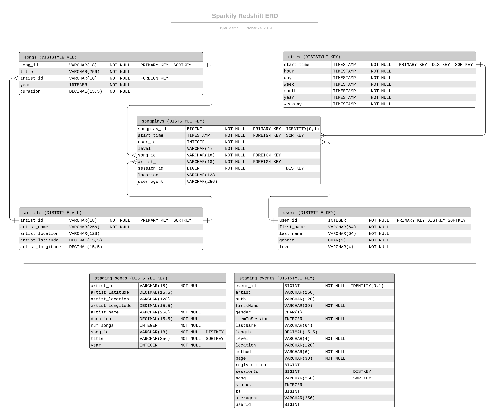
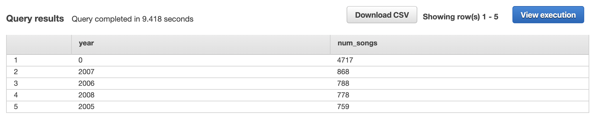
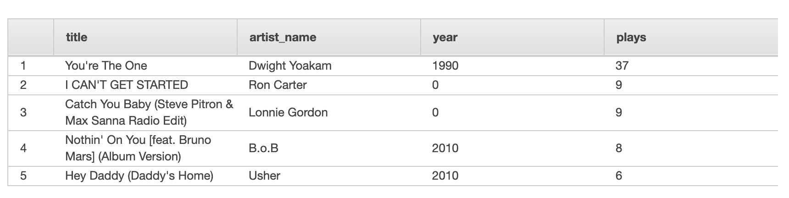
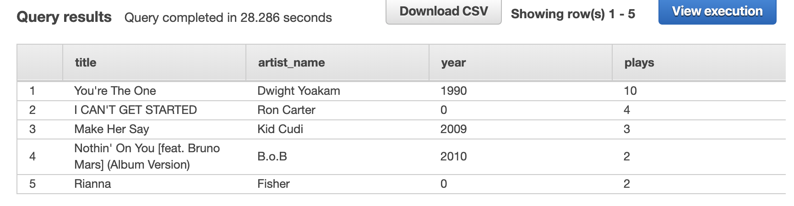

# Sparkify Songplay ETL

This project creates an ETL pipeline for Sparkify to analyze its users' songplays.  By transforming event data and song metadata into a queryable database via a star schema, analytical queries can be run more quickly.  Furthmore by using Amazon Redshift to host the database, the data can be distributed across parallel slices to optimize specific query patterns and gain business insight.

## Usage

To connect, create, and populate the database simply run `test.ipynb` which consists of two commands

```
!python create_tables.py
!python etl.py
```

## Project Files

```
project root/
|
|-- create_tables.py            # Python script to create DB tables
|-- dwh.config                  # Config for connectiong to the AWS Redshift cluster
|-- etl.py                      # Python script to do ETL of data
|-- README.md                   # Project info (this file)
|-- sql_queries.py              # Main SQL queries 
|-- test.ipynb                  # Notebook to create tables and run ETL

```
## Database Design

### Schema


### Details

In order to get the most of Redshift it's important to distribute data uniformally across the node slices.  Furthermore to speed up queries that make use of JOINs, as between fact tables and dimension tables, it is important to have the joined tables' data colocated on the same node whenever possible. 

For the **staging_events** table it is assumed that in real life there would be many orders of magnitude more events than songs or users; therefore, 'sessionId' is used to uniformally distribute the events based on its high cardinality.  In addition 'song' is chosen as the sortkey to speed up joins with 'staging_songs' based on the song name, or 'title'.

The **staging_songs** table uses 'song\_id' as the distkey because of its high cardinality and also uses 'title' as the sortkey to speed up joins with 'staging_events'.  A diststyle of ALL could have also been used because song data for 20 million songs should be only ~20GB of storage used on each node assuming each record is about 1KB.  Assuming we have lots and lots of events, 20GB of song metadata is not that much.

The **artists** table is distributed to all nodes to speed up JOINs with 'songplays' because getting artist name will be common when doing analytics on 'songplays'.  Also for 2 million artists in the table there should be only ~2GB of storage used on each node assuming each record is about 1KB.  Choosing 'artist\_id' as the sortkey should make JOINs with 'songplays' faster when joining on 'artist\_id'.

The **songs** table is distributed to all nodes to speed up JOINs with 'songplays' because getting song name will be common when doing analytics on 'songplays'.  In theory for 20 million songs in the table there should be only ~20GB of storage used on each node assuming each record is about 1KB.  Choosing 'song\_id' as the sortkey should make JOINs with 'songplays' faster when joining on 'song\_id'.

The **songplays** table is distributed by 'session\_id' because it has high cardinality.
Also the table is sorted by 'start\_time' because time window queries are a common type of analysis.

The **users** table is distributed by 'user\_id' because it has high cardinality for what is potentionally a large table in real life with 2-200 million users (See spotify user count).
Also the table is sorted by 'user\_id' for faster JOINs with the facts table 'songplays'.

In practice there should be lots of 'songplay' records and therefore timestamp cardinality should be very high.  The **times** table uses the 'start\_time' timestamp column as distkey and sortkey to support time window queries assuming redshift distributes the timestamps uniformly accross the slices via consistent hashing. 

## Example Queries

### Top 5 years with most songs
```
SELECT year, COUNT(DISTINCT title) AS num_songs FROM songs
GROUP BY year 
ORDER BY num_songs DESC LIMIT 5
```


### Top 5 songs
```
SELECT title, artist_name, year, COUNT(songplays.song_id) AS plays FROM songplays
JOIN songs ON (songs.song_id = songplays.song_id)
JOIN artists ON (artists.artist_id = songplays.artist_id) 
GROUP BY title, artist_name, year
ORDER BY plays DESC LIMIT 5
```


### Top 5 songs in the latest week of data
```
SELECT title, artist_name, year, COUNT(songplays.song_id) AS plays FROM songplays
JOIN songs ON (songs.song_id = songplays.song_id)
JOIN artists ON (artists.artist_id = songplays.artist_id)
WHERE songplays.start_time >= (SELECT MAX(start_time) FROM times) - interval '1 week'
AND songplays.start_time <= (SELECT MAX(start_time) FROM times)
GROUP BY title, artist_name, year
ORDER BY plays DESC LIMIT 5
```
