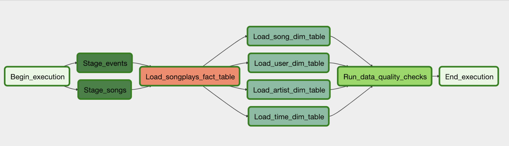
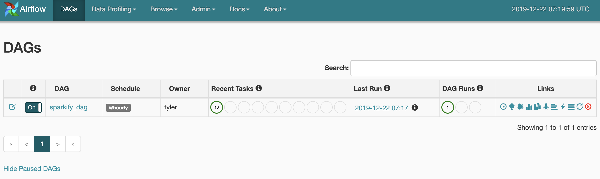
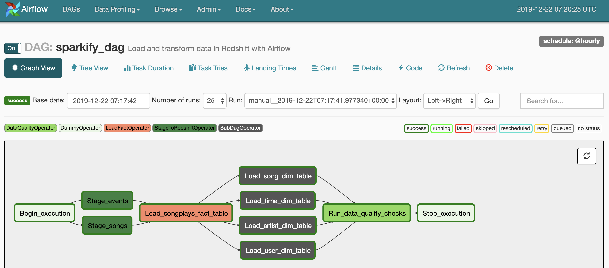

# Sparkify on Airflow

## Summary
This project makes use of Apache Airflow to setup a regularly scheduled data pipeline, which extracts new user songplays from s3 log data and loads our familiar fact and dimension tables.

### Project Structure
```
/workspace
|-- airflow/
    |-- dags/
        |-- dim_subdag.py               Dimension table subdag
        |-- sparkify_dag.py             Main DAG for sparkify songplays data pipeline
    |-- plugins/                        Plugins for airflow
        |-- helpers/                    Helpers for plugins
            |-- __init__.py             Helpers plugin configuration
            |-- sql_queries.py.         SQL queries for creating and inserting data
        |-- operators/                  Dir for airflow operators
            |-- __init__.py             Operator plugin configuration
            |-- data_quality.py         Data validity checks operator
            |-- load_dimension.py       Operator to load dimension tables in redshift
            |-- load_fact.py            Operator to load fact table in redshift
            |-- stage_to_redshift.py.   Operator to extract JSON files from S3 and load into redshift staging tables
        |-- __init__.py                 Plugin configuration
    |-- create_tables.sql               Unused create_tables.sql (create queries moved to sql_queries.py)
|-- REAMDE.md                           This file
```
## Pipeline
The pipeline is triggered hourly and appends new data into the songplays fact table and generates new dimension tables using the "truncate-insert" pattern.  Our pipeline is set to retry failed jobs every 5 minutes for a max of 3 retries.  Additionally, a max parallelism of 4 workers can be achieved given the constraints of the task dependencies.

## DAG

Here is a graph of our jobs showing what gets triggered hourly.  Each node in the DAG corresponds to an operator which is run as a DAG task.

1. After the dummy start operator, the initial staging operators take event and song JSON files from S3 and load them into AWS Redshift tables for staging. 
2. Next the songplays fact table is created if it doesnt exist.  On subsequent pipeline runs, new rows will be appended.  This table has all the fields necessary to record a song play.
3. The dimension tables are populated next from scratch for each run of the pipeline because they are assumed to be orders of magnitude smaller than the fact table.  These load dimention operators are wrapped in a SubDAG operator for easier reuse of the code.
4. Finally we have some data validity checks to make sure there are no NULL values in some of the important columns of the songplays, songs, and artists tables.

### Results
Some images of the completed DAG





